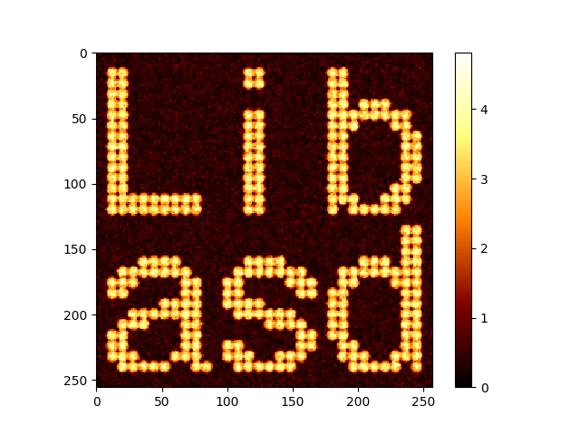

# libasd

[](https://travis-ci.org/ToruNiina/libasd)
[](https://github.com/ToruNiina/libasd/releases)
[](https://github.com/ToruNiina/libasd/blob/master/LICENSE)
[](https://doi.org/10.5281/zenodo.1209119)

A C++11 header-only library to read an `.asd` file generated by high-speed AFM,
depending only on the C++ standard library.

libasd provides a binding for Python3 depending on
[pybind11](https://github.com/pybind/pybind11).



## Table of Contents

- [libasd](#libasd)
- [Python usage](#usage-in-python3)
    - [Building Python Library](#building-python-library)
    - [Example Code](#example-code)
    - [With Numpy](#with-numpy)
    - [Miscellaneous](#miscellaneous)
- [C++ usage](#usage-in-c)
- [FAQ](#faq)
    - [Read file header only, not whole data](#i-need-only-file-header-information-frame-data-are-not-needed)
    - [Without iostreams](#i-dont-want-to-use-streams-what-can-i-do)
    - [How does it contain data](#how-it-contains-data)
    - [Hook Container and Allocator](#can-i-use-my-awesome-container-with-libasd)
- [Licensing terms and Citation](#licensing-terms)

## Usage in Python3

### Installation via pip

If you are ...

- on Windows (x86\_64), macOS (x86\_64), or Linux (x86\_64) and
- using Python 3.6, 3.7, 3.8, 3.9, 3.10, or 3.11,

you can install it via pip.

```console
$ pip install libasd
```

The complete list of supported environment can be found [here](https://pypi.org/project/libasd/#files)

Otherwise, you need to build it by yourself (see the following section).

### Building by yourself

It depends on [pybind11](https://github.com/pybind/pybind11).
The build script uses [CMake](https://cmake.org/).
Please make sure that you have installed `cmake`.

```console
$ git clone --recursive https://github.com/ToruNiina/libasd.git
$ pip install --user ./libasd
```

### Example Code

After installation, you can use the library in the following way.

```python
import libasd
import numpy as np
import matplotlib.pyplot as plt

data = libasd.read_asd("example.asd")

print("version    = {}"     .format(data.header.file_version))
print("image size = {}x{}"  .format(data.header.x_pixel, data.header.y_pixel))
print("there are {} frames.".format(len(data.frames)))

plt.imshow(data.frames[0].image(), cmap="afmhot")
plt.show()
```

Unlike C++ version, Python version requires neither a version information nor
a channel information. By reading the file, it extracts the information at a
runtime, dynamically. C++ version requires both of them in order to determine
types at a compile time, statically.

If the file contains several channels, then the data will have `data.channels`
that is a list of frames.

```python
print("version            = {}".format(data.header.file_version))
print("number of channels = {}".format(len(data.channels)))
print("type of channel1   = {}".format(data.header.data_type_1ch))
print("type of channel2   = {}".format(data.header.data_type_2ch))
print("number of frames: 1ch = {}, 2ch = {}".format(len(data.channels[0]), len(data.channels[1])))

# It plots 10-th frame in the first(0-th) channel.
plt.imshow(data.channels[0][10].image(), cmap="afmhot")
plt.show()
```

For more details, run `help(data)` on the python interpreter.

### With NumPy

Because libasd aims the interoperability with NumPy, `frame.image()` function
returns `numpy.ndarray`.

```python
img = data.frames[0].image() # img is numpy.ndarray
```

`libasd.Frame` also has `data` object as a member that contains the same
information as the return value of `image`.
It uses `Buffer protocol` relying on pybind11 that enables users to cast
a `libasd.Frame` object to NumPy Array __without__ copying all the elements
in the frame (don't forget to set `copy = False`).

```python
import libasd
import numpy as np

# read the data
data = libasd.read_asd("example.asd")

# cast frame data into numpy Array
frame_0 = np.array(data.frames[0].data, copy = False)
```

To manipulate the frame datas, it is recommended to cast the data to the NumPy
Arrays.

### Miscellaneous

Python binding provides a method to read a header information only.

```python
import libasd

header = libasd.read_header("example.asd")

print("version    = {}"   .format(header.file_version))
print("image size = {}x{}".format(header.x_pixel, header.y_pixel))
```

And it also supports reading raw data. `read_asd` returns frame data after
converting the raw data to the height information, but `read_raw_data` returns
frames without any conversion.

```python
import libasd

raw_data = libasd.read_raw_data("example.asd")
raw_frame_0 = np.array(raw_data.frames[0].data, copy = False)
plt.imshow(raw_frame_0)
plt.show()
```

## Usage in C++

libasd is a header-only library, so you don't need to build anything if you use
it in your C++ code.

The only thing you have to do is adding `path/to/libasd` to your include path
when you compile your code.

```sh
$ g++ -I/path/to/libasd -std=c++11 your_code.cpp
```

Then you can read the data in the way described below.

```cpp
#include <libasd/libasd.hpp>
#include <fstream>
#include <iostream>

int main()
{
    std::ifstream ifs("example.asd");
    const auto data = asd::read_asd<double>(ifs);

    std::cout << "x_pixel = " << data.header.x_pixel << '\n';
    std::cout << "y_pixel = " << data.header.y_pixel << '\n';

    for(auto const& frame : data.frames)
    {
        for(auto const& line : frame)
        {
            for(auto const& pixel : line)
            {
                std::cout << pixel << ','; // height [nm] for topography, ...
            }
            std::cout << '\n';
        }
        std::cout << "\n\n";
    }
    std::cout << std::flush;
    return 0;
}
```

Here you can access each frame, line, and pixel intuitively by using range-based
for loops.

For the N-channel data, you need one more loop.

```cpp
#include <libasd/libasd.hpp>
#include <fstream>
#include <iostream>

int main()
{
    std::ifstream ifs("example.asd");
    const auto data = asd::read_asd<double, asd::ch<2>>(ifs);

    std::cout << "x_pixel = " << data.header.x_pixel << '\n';
    std::cout << "y_pixel = " << data.header.y_pixel << '\n';

    for(auto const& frames : data.channels)
    {
        for(auto const& frame : frames)
        {
            for(auto const& line : frame)
            {
                for(auto const& pixel : line)
                {
                    std::cout << pixel << ','; // height [nm] for topography, ...
                }
                std::cout << '\n';
            }
            std::cout << "\n\n";
        }
    }
    std::cout << std::flush;
    return 0;
}
```

You can set file version and channel as a template parameter.

```cpp
const auto data = asd::read_asd<double, asd::ch<2>, asd::ver<0>>(ifs);
```

By default, these are set as channel 1, version 1 respectively.

You can access to each pixel in each line by index.

```cpp
    const std::size_t x_pixel = data.header.x_pixel;
    const std::size_t y_pixel = data.header.y_pixel;
    for(const auto& frame : data.frames)
    {
        for(std::size_t y=0; y<y_pixel; ++y)
        {
            for(std::size_t x=0; x<x_pixel; ++x)
            {
                std::cout << frame[y][x]; // note: not [x][y].
            }
            std::cout << '\n';
        }
        std::cout << "\n\n";
    }
```

Be careful with the order of index. `Frame[y]` returns a `Line` at `y`.
So first you must specify `y` value of the pixel.

## FAQ

### I need only file-header information. Frame data are not needed.

libasd provides `asd::read_header` function (`libasd.read_header` in python).
It reads only file-header information.

```cpp
#include <libasd/libasd.hpp>
#include <fstream>
#include <iostream>

int main()
{
    std::ifstream ifs("example.asd");
    const auto data = asd::read_header(ifs);
    // If you want to set file version information,
    // data = libasd.read_header<asd::ver<2>>("example.asd");
    // file version is set as asd::ver<1> by default.
    return 0;
}
```

```python
import libasd

data = libasd.read_header("example.asd");
# If you want to set file version information,
# data = libasd.read_header("example.asd", version = 2);
```

It does not need the channel information because header format does not depend
on the number of channels.

### I don't want to use streams. What can I do?

You can pass a `char const*` to `read_asd` function in exactly the same way as
iostreams.

### How does it contain frame data?

It contains pixels in one frame data by one, contiguous container.

You might think that libasd contains a frame as an array of arrays because
you can access to the pixel by using this form `frame[y][x]`.
So you might be afraid of the performance loss that is owing to a cache-miss
while you access to each line. But it is __NOT__ true.

To make the usage easier, libasd provides a proxy class to access each lines.
It wraps frame class and enable you to access a particular line by using
container-like interface.

You can use raw `std::vector<pixel_type>::(const_)iterator` in the following
way if you want.

```cpp
const auto frame = data.frames.front();
for(auto iter = frame.raw_begin(), iend = frame.raw_end(); iter != iend; ++iter)
{
    std::cerr << *iter << ' '; // you can traverse all the pixel in one frame!
}
```

### Can I use my awesome container with libasd?

If you implemented or found a container or an allocator that has a great feature,
you may want to use it with libasd instead of `std::vector<T, std::allocator<T>>`.

In libasd, you can specify the container used to store pixel data by passing the
special struct as a template parameter. __NOTE__: The container should be
randomly accessible(by using `operator[]`). But `ContiguousContainer` concept is
not required (e.g. `std::deque` can be used as a backend container).

For example, `asd::container::vec` that is used by default is defined as follows.

```cpp
namespace asd {
namespace container {

struct vec
{
    template<typename T>
    struct rebind
    {
        typedef std::vector<T, std::allocator<T>> other;
    };
};

template<typename T, typename Alloc>
struct container_traits<std::vector<T, Alloc>>
{
    using ptr_accessibility = std::true_type;
    using value_type = T;
};

} // container
} // asd
```

libasd uses `vec` class to define container in the same way as STL does to define
allocators.

```cpp
typedef typename vec::template rebind<int>::other int_array;
```

The struct `container_traits` provides a tag to dispatch utility functions.
If the container has an interface to access the pointer that points
the first element as a traditional C-array, `ptr_accessibility` is set as
`std::true_type`, otherwise, `std::false_type`.

Additionally, to deal with different interfaces of containers, libasd has
some helper functions. If it is needed (the container has a different interface
from standard containers), you should overload these functions.

Fortunately, if your awesome container has member functions that are named in
the same way as STL containers (e.g. `data()`, `size()`, `resize()` and
`clear()`), libasd automatically finds and uses them.

```cpp
// example: add overload for std::vector.

namespace asd {
namespace container {

template<typename T, typename Alloc>
inline T const* get_ptr(const std::vector<T, Alloc>& v) noexcept
{
    return v.data();
}
template<typename T, typename Alloc>
inline std::size_t size(const std::vector<T, Alloc>& v) noexcept
{
    return v.size();
}
template<typename T, typename Alloc>
inline void resize(std::vector<T, Alloc>& v, const std::size_t N)
{
    return v.resize(N);
}
template<typename T, typename Alloc>
inline void clear(std::vector<T, Alloc>& v)
{
    return v.clear();
}

} // container
} // asd
```

After implementing these structs and functions,
you can use your awesome container/allocator class with libasd by passing
your dispatcher to `read_asd` function.

By default, `asd::container::vec` and `asd::container::deq` are defined in
`libasd/container_dispatcher.hpp`.
They correspond to `std::vector` and `std::deque`, respectively.

Additionally, you can find `asd::container::boost_vec`,
`asd::container::boost_static_vec`, `asd::container::boost_small_vec`
and `asd::container::boost_deq` in the file
`libasd/boost/container_dispatcher.hpp`.
It is not included by default, but you can manually include this file.
Then you can use containers provided by the Boost.Container library if you
already installed it.

## Licensing terms

Author
- Toru Niina

cite as

```
Toru Niina. (2018, March 28). ToruNiina/libasd v1.0.0 (Version v1.0.0). Zenodo. http://doi.org/10.5281/zenodo.1209119
```

This product is licensed under the terms of the [MIT License](LICENSE).

- Copyright (c) 2017 Toru Niina

All rights reserved.
